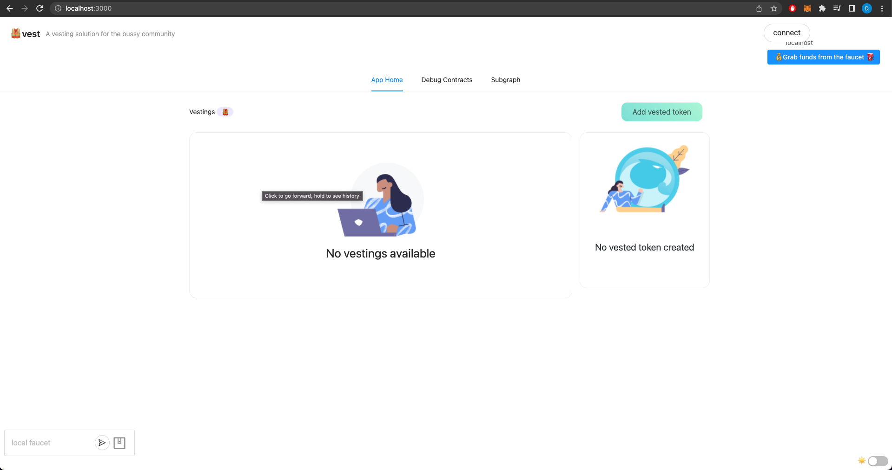
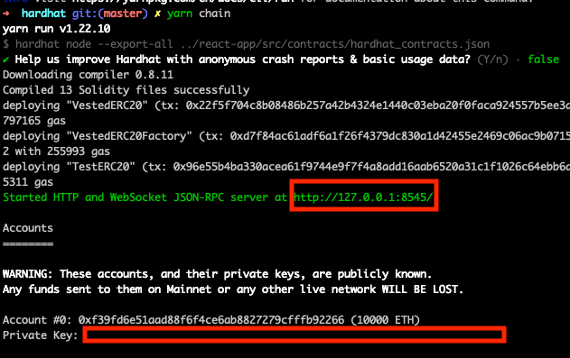
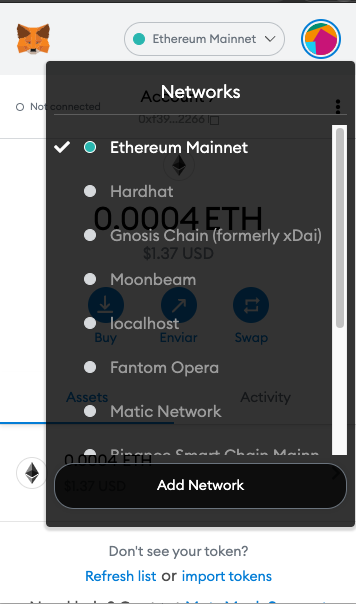
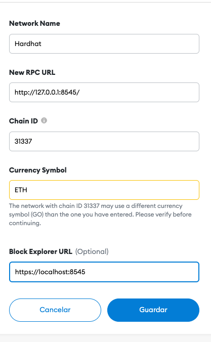
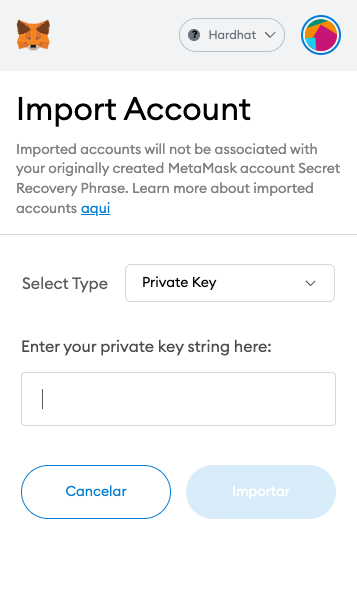

# Vest

## Introduction

Application for vesting to earn a right to tokenomics.

## Running Development Mode

## Installation

### Pre-requirements

- Install [Node v14](https://nodejs.org/dist/latest-v14.x/) locally to avoid possible issues
- Install Yarn
- [Install Docker](https://www.docker.com/products/docker-desktop/)

```bash
npm install --global yarn
```

### Install dependencies

Install the dependencies

```bash
yarn install
```



## Run dependencies & Start App

Run each on independent process.

### Hardhat

```bash
yarn chain
```

### Graph-Node

```bash
yarn clean-graph-node
yarn run-graph-node
```

### SubGraph

```bash
cd packages/subgraph
yarn prepare
yarn create-local
yarn codegen
yarn build
yarn deploy-local
```

**WARNING:** if `yarn prepare` fails with `Could not find file: config/config.json` do the following:

```bash
yarn postdeploy
```

### React-App

```bash
yarn start
```

### Metamask Setup

For the metamask setup, after [Hardhat](#hardhat) is running








